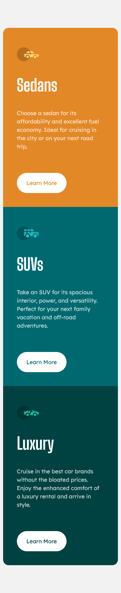
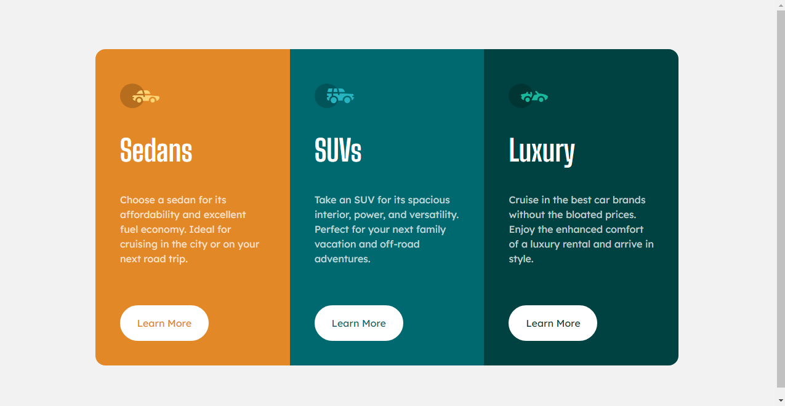
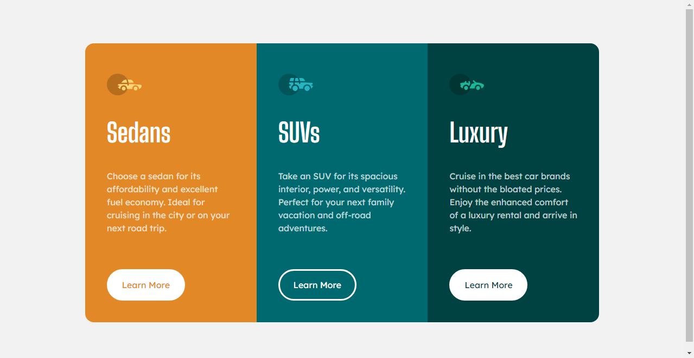

# Frontend Mentor - 3-column preview card component solution

This is a solution to the [3-column preview card component challenge on Frontend Mentor](https://www.frontendmentor.io/challenges/3column-preview-card-component-pH92eAR2-).

## Table of contents

- [Overview](#overview)
  - [The challenge](#the-challenge)
  - [Screenshot](#screenshot)
  - [Links](#links)
- [My process](#my-process)
  - [Built with](#built-with)
  - [What I learned](#what-i-learned)
  - [Continued development](#continued-development)
- [Author](#author)

## Overview

### The challenge

Users should be able to:

- View the optimal layout depending on their device's screen size
- See hover states for interactive elements

### Screenshot

### Links

- [Github repo](https://github.com/nurmarief/fementor_3-column-preview-card)
- [Live site](https://nurmarief.github.io/fementor_3-column-preview-card/)

## My process

### Built with

- Semantic HTML5 markup
- CSS custom properties
- Flexbox
- CSS Grid
- CSS Transtitions
- Mobile-first workflow
- BEM architecture for CSS
- Webpack 5

### What I learned

In this challenge, I continue to learn about BEM Architecture priciples for CSS:

1. only use class selector for styling,
2. avoid using complex selectors to prevent unexpected behavior because CSS specificity,
3. split css into blocks or components,
4. organizing CSS files by blocks,

In addition, i also learn code bundling using webpack 5.

## Author

- [@nurmarief](https://www.frontendmentor.io/profile/nurmarief)
